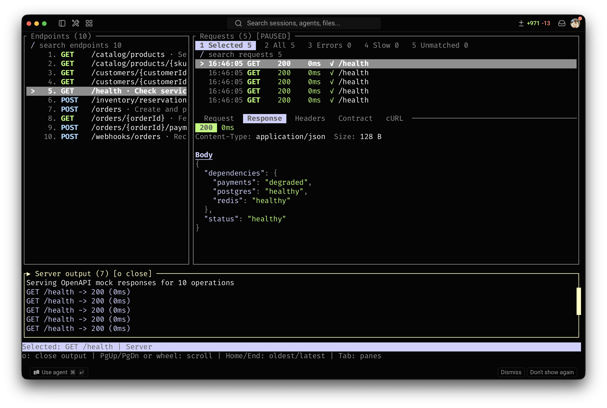

# LazyAPI

LazyAPI is a terminal tool for OpenAPI services.
It can capture, validate, mock, proxy, save, load, and replay HTTP traffic.
It masks sensitive data by default.



The demo uses the included [commerce OpenAPI document](demo/commerce-openapi.yaml) and finishes with a deliberately invalid request so contract findings, secret redaction, search, cURL generation, and replay are all visible.

## Install

With Homebrew:

```bash
brew install SirwanAfifi/tap/lazyapi
```

From a source checkout:

```bash
cargo install --path .
```

Building from source requires Rust 1.88 or later.

## Requirements

- An OpenAPI 3 document in JSON or YAML format

## Start LazyAPI

Start the sample service:

```bash
lazyapi --spec ./testdata/sample_openapi.yaml
```

Then send a request from another terminal:

```bash
curl -i http://127.0.0.1:3000/users
```

The server uses `127.0.0.1:3000` by default.

To send requests to another service, add its base URL:

```bash
lazyapi \
  --spec ./openapi.yaml \
  --target http://127.0.0.1:8080
```

To run the larger commerce demo shown above:

```bash
lazyapi --spec ./demo/commerce-openapi.yaml
```

Then, in another terminal:

```bash
./demo/send-commerce-traffic.sh
```

## Save a session

Use `--save FILE` to save traffic as JSON, JSONL, NDJSON, or HAR.
Use `--load FILE` to load a JSON, JSONL, or NDJSON session.

```bash
lazyapi --spec ./openapi.yaml --save ./capture.json
lazyapi --spec ./openapi.yaml --load ./capture.json
```

If you must record sensitive data, use `--no-redact`.

## Use the terminal interface

- Use `Up` and `Down`, or `k` and `j`, to select an item.
- Use `Tab` to select a pane.
- Use `/` to search.
- Use `Enter` or `Space` to show traffic for an operation.
- Use `R` to review and replay a request.
- Use `c` to show a cURL command.
- Use `?` or `h` to show help.
- Use `q` or `Ctrl+C` to stop LazyAPI.

Use `lazyapi --help` to see all options.

## Release

Tagged releases build native Apple Silicon and Intel macOS archives and publish the generated formula to the Homebrew tap. See [the release guide](docs/releasing.md) for the one-time tap setup and release checklist.

## Test the code

```bash
cargo fmt --check
cargo clippy --all-targets --all-features -- -D warnings
cargo test --all-targets --all-features
```

## License

MIT © Sirwan Afifi
